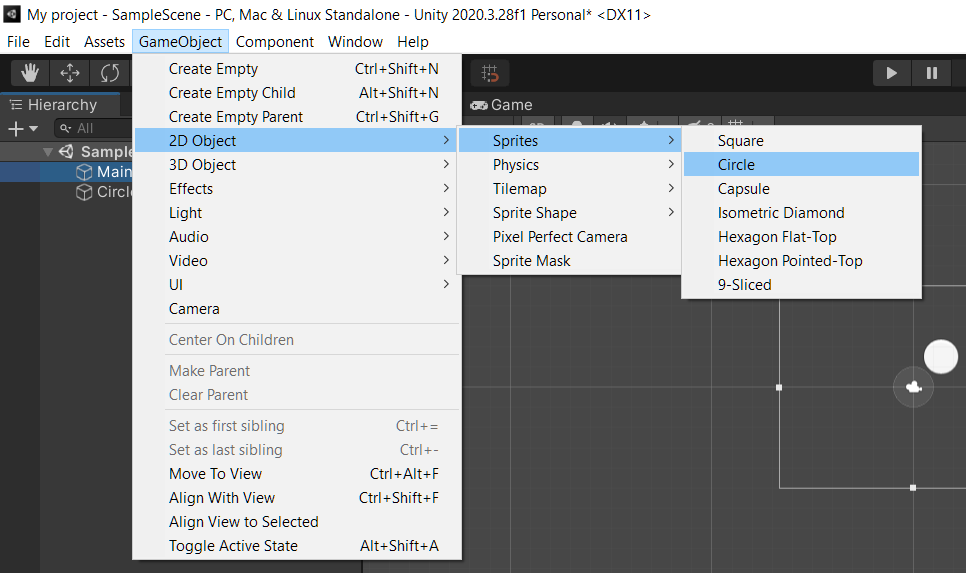
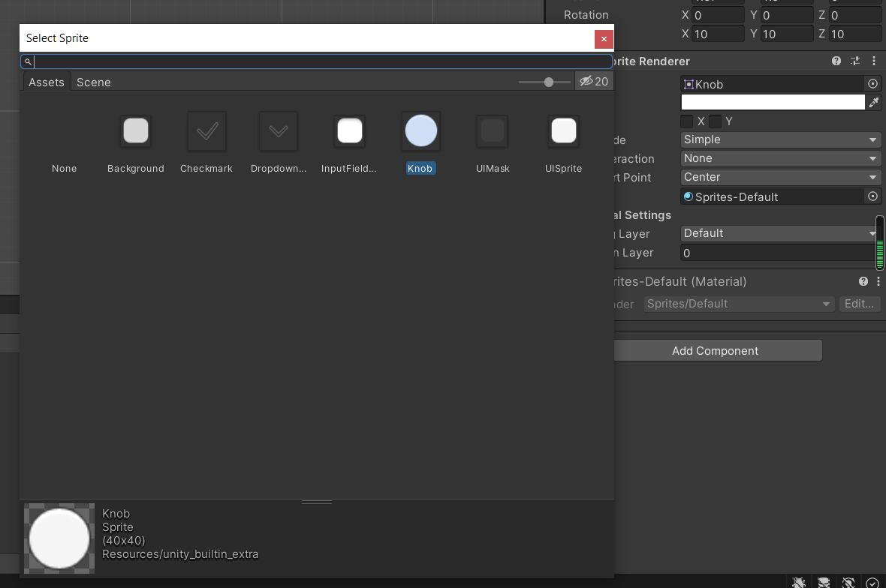
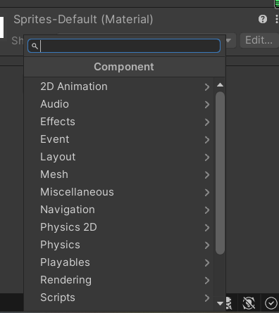

# Entry 3
##### X/X/XX

Through out the passing days, I have explored many aspects of how objects, not sprites, work in Unity 2D. Some of them I have to search online for tutorials for as my previous tutorials didn't mention them, this lead to me having a [new tutorial](https://www.youtube.com/watch?v=Lu76c85LhGY) to base by basics around. However, searching up everything isn't going to help me in the future, this means I did infact do some self-discovery and found myself some solutions/answers to my issues/questions.

Here are the following, in order, for what I learned the past few days 

1. Due to some reasons, I don't really want to use other people's artwork as placeholder of my objects for obvious reasons. Thus I have to make a simple square/circle placeholder so I can experiment with my software further.
GameObject -> 2D Object -> Sprites -> Circle 

2. Following up from the previous step, since I have to change the placeholder sprite into my own drawing later on down the line, I also fundled with the software and figured out out how to change the sprite of the object 
Inport your own picture of desired sprite into assets folder (I currently don't have the artowkr done)
Right hand side -> Click on the target like shape -> Choose desire sprite 

3. This is my discorvery, at this point I have no idea what to do I searched up some videos on Google. I picked on the video and the video showed me something very important; something that I will have to experiment alot with as there was alot of options to go through. And that is Add Component. This opens up to things like physics and player control, which is alot to get through

-----

For my next steps is definity look into what I mentioned in step 3 as it was the most important part of the entire Unity 2D engine in my opinion. I am also planning to learn how animations work in the program as well and I honestly think I need another tutorial to help me with that

Using "How to Google" and "Growth mindset". I googled up tutorials that helped me with certain parts of my learning and i kept my growth mindset and experimented with certain aspects of my software.

[Previous](entry02.md) | [Next](entry04.md)

[Home](../README.md)