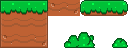
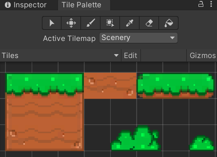
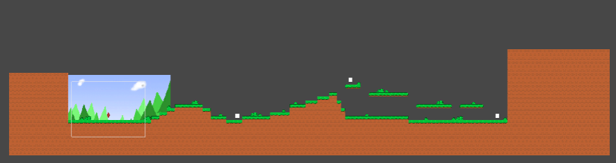

# Entry 4
##### 5/6/2022 (Makeup Work)

In the weeks around the time for this entry to be due, I worked on tile maps and more artwork that I am going to use in my project.
Tilesmaps can be set up in unity so that you can select such tiles and place them on the scene, they do require some setup and understanding. Like setting pixel per unit, I set mines to 16 per unit due to my pixelart for each tile is 16 x 16
You also need to create a new object to put Tilemap and Tilemap Renderer into in order to add the tiles on to them

By using the tiles setup above, I created a stage that look like this 

As you can see above, I also added some scenery and background for decorational purposes. They don't do much but to add looks
But moving on, I later proceeded to add the player (the red crystal) into the mix, and Rigid Body 2D property on to it. At first, it started to fall through the stage. 
I have to search online to fine out how to do collisions, and turns out they are actually really simple. I added Tilemap Collider 2D to the terrian and a Box Collider 2D to the player. 
This ended up the player landing on the ground and not falling though the stage. 

-----

For my next steps, I am going to finish this by adding movement and health/simple combat system

Using "How to Google" and "Debugging". I figure a pathway to building my project and I corrected my mistakes as I worked on it 

[Previous](entry03.md) | [Next](entry05.md)

[Home](../README.md)