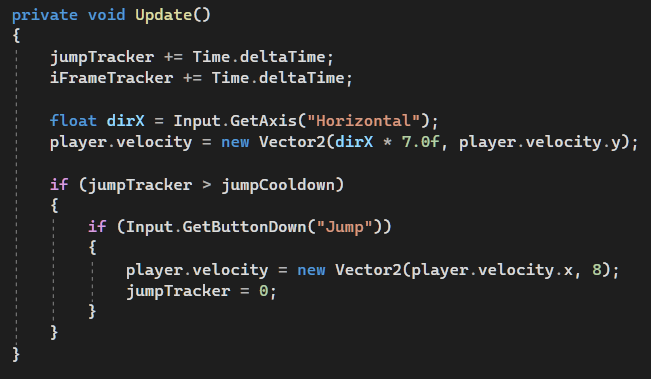

# Entry 5
##### 5/8/2022

Continuing from previously. I set up all the sprites I needed to use for my project, at least the working part of it.
I immediately started work on the movement. This time I needed some help as well due to me being new to the Unity side of things. I found that untiy have already have some keybinds setup for me to use. And even if they don't work, I can always use GetKeyDown to use the more primitive way 
Along with some tweeking that totally didn't take me over half of my day, this is what I got that is working fine.

And of couse, we can't forget about the "slime" (square as of now, animation is beyond mvp)
Named it jump cause slimes jump at you in those good ol' RPG games

You would notice I put --.velocity besides a number. I don't want to do that cause we are creating a new velocity, setting it like a 0 will make really unresponse when you jump, since it will stop all your momentum.
But by stating what I said above, it check for your current speed and put it in as your new speed. So basically no changes. Moving on

-----

Attack is quite simple for me, I just have to set up collision hitboxs and add in some flaoting values plus some previous research

-----

At the start, you would be able to spam jump and attack without any delay. This is the part that took me 3 days to figure out. But it turns out you just need 2 float numbers and Time.deltaTime;
I was really upset at this. But I figured it out 

Time.deltaTime basically accounts for how much frame mean in a second, it could be 1/30 of a second. And what I did is added it to a float number, and when that float number passes a certain point and using a boolean, I can prevent user from doing actions before the counter reach a certain point. After they preform an action like jump, I will just reset the counter back to 0.

-----

Next steps is definity animation and attack animation for the red crystal, it would be a flash around it and it will damage all the things in it's surrounding

Using "Embracing failure" and "Debugging". I kept doing at what I don't understand and kept going for it, trying to fix that one little issue until there is a solution.

[Previous](entry04.md) | [Next](entry06.md)

[Home](../README.md)